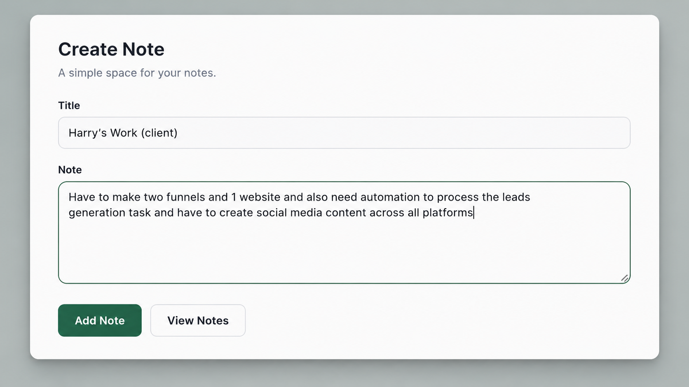

# 📝 Notes App

A clean and user friendly note-taking application built with React that allows users to create, edit, delete, and organize notes. Notes are automatically saved using local storage, ensuring they persist between sessions.

## Live Demo

🔗 https://adilnotesapp.netlify.app/

---

## Preview



---

##  Features

-  Create new notes
-  Edit existing notes
-  Delete notes
-  Automatic local storage persistence
-  Fast and responsive interface
-  Fully responsive design
-  Clean and modern UI

---

##  Built With

- React
- JavaScript (ES6+)
- Vite
- CSS3
- Local Storage 

---

## 📂 Project Structure

```
notes-app/
├── assets/
├── public/
├── src/
│   ├── components/
│   ├── App.jsx
│   ├── main.jsx
│   └── index.css
├── package.json
└── README.md
```

---

## 📄 License

This project is open source and available under the MIT License.
